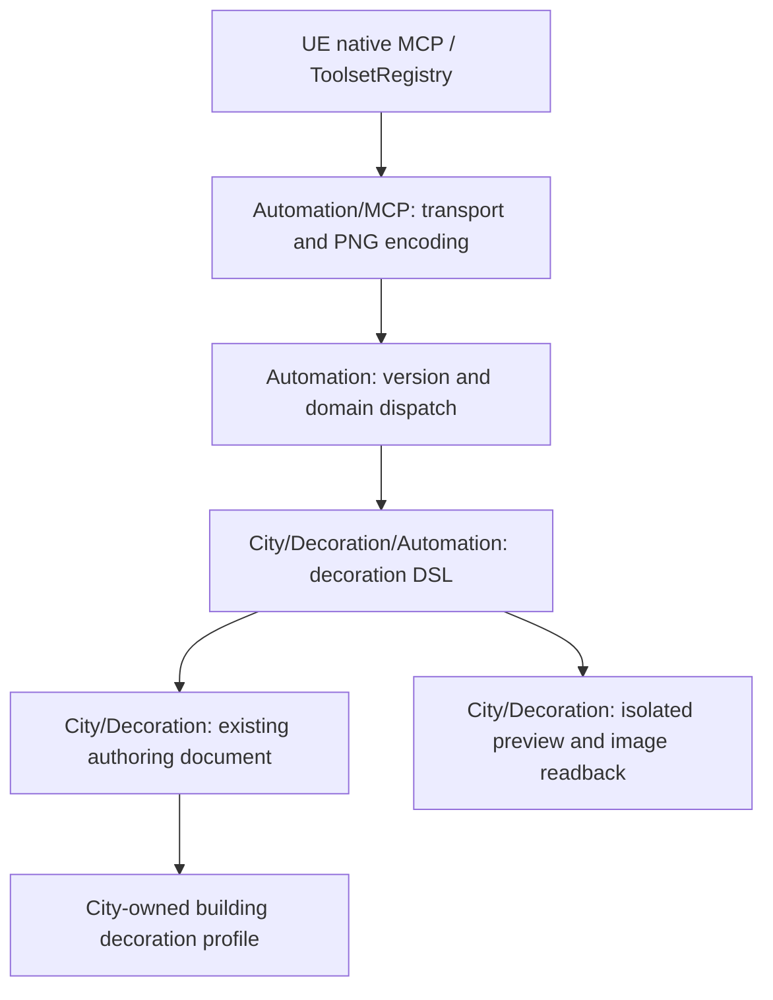

# UE 5.8 PCG automation / MCP

The editor module registers `DeepLevelDesignPCGEditor.DeepLevelPCGToolset` with UE 5.8's native ToolsetRegistry. The existing Unreal MCP server exposes it. No independent server, Python bridge, runtime dependency or project-specific policy is introduced.

Two tools: `Describe()` returns the versioned DSL contract; `Execute(Request)` accepts one JSON string. Discover once, then combine inspection, changes, validation and optional image capture in each Execute call.

## Ownership



The adapter owns no domain state. The dispatcher owns the common request envelope and domain routing. Decoration owns its operations, identities, validation and preview. Shared response data contains only JSON and optional pixels; domain executors do not depend on MCP.

Road and Building executors can later join this dispatcher and the Describe contract. Their asynchronous generation must have a deliberate completion/cancellation contract before being exposed; the synchronous decoration executor does not pretend to generate a city.

## First supported scope

Existing profiles linked through a City Decoration Set: inspect catalog/profile data; add/update/duplicate/remove variants and entries; reorder entries; create/update/remove transform links. Meshes, actor Blueprints and decal materials use the same asset classification and authoring rules as drag-and-drop in the editor. Links support different assets, independent location/rotation/scale synchronization, mirror/copy rotation and offsets.

Asset creation, catalog editing, profile assignment and level regeneration are outside this first scope. No arbitrary property writes or function execution are exposed.

## Calls

Use exact object paths returned by inspection, not asset-name guesses. A catalog inspection omits `building`:

```json
{"version":1,"domain":"decoration","set":"/Game/_SoC/Environment/PCG/CityDecoration/DA_SoC_CityDecorationSet.DA_SoC_CityDecorationSet","operations":[]}
```

Supply a returned building class path to inspect its profile. The response includes GUID identities for variants and entries. Names are labels, not identities. New identities can be referenced as `$alias` later in the same batch.

```json
{
  "version":1,
  "domain":"decoration",
  "set":"<set object path>",
  "building":"<catalog building class path>",
  "operations":[
    {"op":"variant.add","name":"Facade","as":"v"},
    {"op":"entry.add","variant":"$v","asset":"/Engine/BasicShapes/Cube.Cube","location":[100,200,300],"as":"a"},
    {"op":"link.create","variant":"$v","entry":"$a","axis":"Y","as":"b"}
  ],
  "variant":"$v",
  "capture":true,
  "save":false
}
```

Positions are building-local centimeters. Rotations are `[pitch,yaw,roll]` degrees. Scale and scale multipliers are dimensionless. Symmetry planes come from the calibrated building placement volume. Existing target links preserve placements by capturing offsets; specified offsets override those values.

## Application and image contract

- Every batch uses the existing document methods on transient staged profile data. All operations and final profile validation must succeed before one live document transaction commits the variants. Failure identifies a zero-based operation index when applicable and leaves live variants unchanged.
- One Undo/Redo applies to the entire batch. Open decoration editors receive the normal property-change notification. A no-op creates no transaction.
- `dryRun:true` validates and optionally captures staged data without a live commit. It cannot be combined with `save:true`.
- `save:false` is the default. `save:true` saves only the selected profile package, including any already-unsaved changes in that profile. It does not save the set, map or unrelated packages. A save failure leaves applied changes undoable and is reported separately.
- `capture:true` draws a separate decoration preview and returns a native `FToolsetImage` PNG in the same tool response. It does not move the user's camera, open an asset editor, run PIE or regenerate a level.
- Optional `captureSize:[width,height]` supports integer sides from 128 to 2048. Optional camera requires `location`, `rotation` and optional `fov` (10–150). Otherwise the preview focuses the building. Capture parameters require `capture:true`.
- `variant` identifies the capture arrangement; it can be an existing GUID or a batch alias. Otherwise the variant explicitly selected by the last operation is used. An inspection-only capture should provide a variant.
- Output includes application/save/capture status, operation IDs and optional full state (`includeState:false` reduces output). Captures include camera metadata and projected entry pivot labels. Pivot labels identify projected positions, not an occlusion/visibility guarantee.
- Capture/readback/PNG failure is explicit and does not undo successfully applied edits. Rendering is unavailable under NullRHI. Check `captured` and `captureError` independently of application success; no stale screenshot is substituted.
- Requests require the editor game thread and no active PIE session. Version 1 rejects unknown domains, operations and fields. Limits: 256 operations and 262144 request characters.

## Verification

`Scripts/Validate-SoC.ps1 -Filter DeepLevelDesignPCG` builds and runs plugin automation. Tests cover atomic rejection, aliases, dry-run, one Undo/Redo, external editor notification, linked transforms, strict fields and native registration/schema. Its NullRHI run verifies explicit unavailable-render behavior; the capture test can also run under a real offscreen renderer to verify PNG output. Interactive Editor/PIE acceptance remains separate.

Current verification: initial editor build and all 85 plugin tests passed. After the preview-size correction, the editor build and all four decoration automation tests passed. With the corrected DLL loaded, `CaptureContract` also passed through the running editor's native MCP AutomationTestToolset with no errors or warnings. That GPU test verifies 256x256 metadata, PNG MIME and nonempty image payload, plus projected decoration pivots. The native `EditorToolset.EditorAppToolset.CaptureViewport` tool separately returned a nonempty PNG. No PIE, production-level test or production asset save was performed.

Fresh independent preview viewports are sized with the engine's `SetInitialSize` API. `SetViewportSize` requires a Slate window and cannot initialize an unattached preview. No window-size recovery fallback is used.

Do not launch GPU verification with `-RenderOffscreen`. That flag changes all native Slate windows into texture-backed windows; the project's FSR Frame Generation callback assumes a normal RHI viewport and asserts before the decoration test begins. This is distinct from reading pixels from a preview render target in a normally running editor. No FSR, engine or third-party code was modified.

For GPU verification after loading the current binary, use the existing editor's AutomationTestToolset: DiscoverTests, then RunTests with `DeepLevelDesignPCG.Editor.City.DecorationAutomation.CaptureContract`. This uses transient-fixture dry-run authoring, not PIE or a production-scene change. No separate offscreen editor process or upscaler configuration change is needed.
